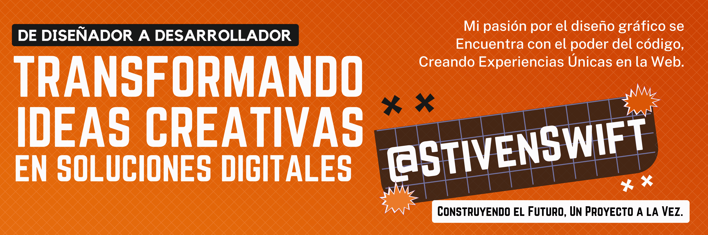

#  Bienvenid@ al GitHub de <a href="https://zamworg.com/"> Stiven Swift 👋

Soy un apasionado del desarrollo web que proviene del mundo del diseño gráfico y el marketing digital B2B. Mi objetivo es combinar mi creatividad y habilidades técnicas para crear experiencias web impactantes y funcionales. Estoy en constante aprendizaje y exploración de nuevas tecnologías, buscando siempre mejorar mis habilidades y contribuir a proyectos innovadores. ¡Conéctate conmigo y acompáñame en esta emocionante travesía en el mundo del código!

## Tecnologías que Me Inspiran 💻

 

 

## Las estadisticas del repositorio
 

## Estás en un mundo divertido

###

###

## ¡Proyectos en *Camino!*
<table>
<tr>
<td width="50%">
<h3 align="center">¡Pronto: Nuestro Proyecto Final del Bootcamp de Desarrollo Web Full Stack!</h3>

Después de una increíble experiencia como campista en <strong>TalentoTech Bogotá</strong>, estoy emocionado de anunciar que estoy colaborando con mis compañeros <strong>Sol Mary</strong> y <strong>Luis Berdugo</strong> en nuestro proyecto final del Bootcamp de <strong>desarrollo web Full Stack</strong>. Juntos, estamos combinando nuestras habilidades y creatividad para desarrollar algo único. ¡Mantente atento, porque muy pronto compartiremos nuestro trabajo y todo lo que hemos aprendido en este emocionante viaje!

                                                                                      
</td>

                                                                                      
</td>  
</table>                                                                                 

 